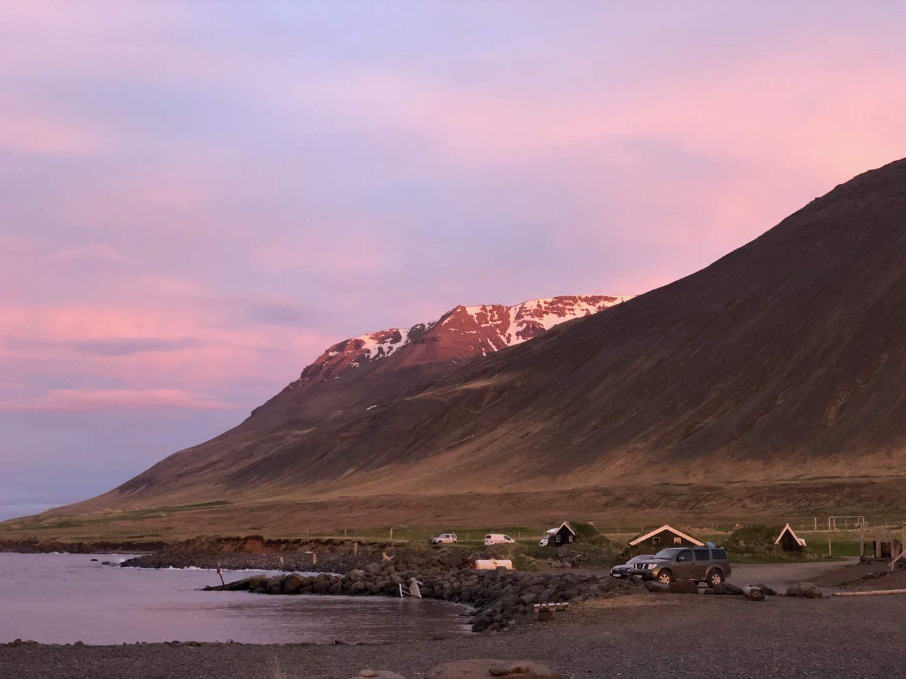

## About Me

I am a **PhD student in Economics** at the **Graduate School of Economics and Social Sciences (GESS)**,  *University of Mannheim*.

Previously, I have studied at the *University of Konstanz* and at the *University of Rome Tor-Vergata* during my MSc in Economics, and at the *University of Milano-Bicocca* for my BSc in Mathematics.

## Research Interest

My main fields of interest are macroeconomics & labor economics, time series econometrics, computational economics and machine learning.

## Projects 

1. #### [Talk – GPU-Accelerated Value Function Iteration in Julia](https://youtu.be/ehUb-S6Bxnk?t=13m42s)
    JuliaCon 2018 - *August 2018*
      
    At JuliaCon 2018 I presented my project on using Julia and GPUArrays.jl to solve macroeconomic models faster when using Value Function Iteration.
2. #### [GPU/OpenCL Value Function Iteration in Julia](https://github.com/giob1994/GPU-OpenCL-VFI-in-Julia)
    Final Project, Computation Economics - *2018*
      
    A simple implementation in Julia of a Value Function Interation algorithm that runs on the GPU thanks to OpenCL.

<!--
## Publications

1. F.Bar, J.Doe: Effects of having a placeholder of a name
2. S.Holmes, J.Watson: Consequences of living with a sociopath in London

## Typography

This is a [link](http://google.com). Something *italics* and something **bold**.

Here is a table

Year | Award | Category
-----|-------|--------
2014 | Emmy  | Won Outstanding Lead Actor in a miniseries or a movie
2015 | BAFTA | Nominated for Best Leading Actor for Sherlock
2014 | Satellite | Won Best Actor miniseries or television film

Here is a horizontal rule

---

Here is a blockquote

> To a great mind, nothing is little

## References

* Foo Bar: Head of Department, Placeholder Names, Lorem
* John Doe: Associate Professor, Department of Computer Science, Ipsum
-->

<figure style="margin-top: 50px;">
    
    <figcaption style="text-align: right; font-size: 0.8em;">
        Skagafj&ouml;r&eth;ur, Iceland
    </figcaption>
</figure>